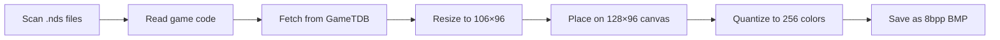

<div align="center">

# PicoCover


**Automatically download and convert Nintendo DS cover art for Pico Launcher**

[](LICENSE)
[](https://www.rust-lang.org/)
[](https://github.com/Scaletta/PicoCover/releases)


*Cross-platform tool to fetch GameTDB cover art, convert to 8bpp BMP format, and organize for [Pico Launcher](https://github.com/LNH-team/pico-launcher) by [LNH-team](https://github.com/LNH-team)*


</div>

---

## ✨ Features

- 🖥️ **GUI Mode** – Simple interface with automatic drive detection
- ⌨️ **CLI Mode** – Full scriptable control for automation
- 🔄 **Auto-update** – Built-in update checker with one-click updates
- ♻️ **Auto-refresh** – Detects new drives without restarting
- 🌍 **Multi-region support** – Tries EN, US, JA, EU until a cover is found
- 🚀 **Fast processing** – Parallel downloads
- 📦 **Native packages** – DMG for macOS, DEB for Linux, EXE for Windows

## 📋 Requirements

- **Rust 1.81+** for building from source
- **Network access** to GameTDB art server
- **Write permissions** to target drive

## 🚀 Installation

### Option 1: Download Pre-built Package (Recommended)
Download the latest release for your platform from the [Releases](https://github.com/Scaletta/PicoCover/releases) page:

- **Windows**: `pico_cover-windows-x64.exe` – Standalone executable
- **macOS**: `pico_cover-macos-x64.dmg` (Intel) or `pico_cover-macos-arm64.dmg` (Apple Silicon) – Disk image
- **Linux**: `pico_cover-linux-x64.deb` – Debian package

[](https://github.com/scaletta/PicoCover/releases/latest)

**Installation instructions:**
- **Windows**: Download and run the `.exe` file
- **macOS**: Download `.dmg`, open it, drag PicoCover to Applications. Right-click → Open on first launch
- **Linux**: `sudo dpkg -i pico_cover-linux-x64.deb` or run the standalone binary

### Option 2: Build from Source
```bash
git clone https://github.com/Scaletta/PicoCover.git
cd PicoCover
cargo build --release
```

The binary will be in `target/release/pico_cover` (or `pico_cover.exe` on Windows).

**Build native packages:**
```bash
# Install cargo-bundle
cargo install cargo-bundle

# macOS .app bundle
cargo bundle --release --target x86_64-apple-darwin     # Intel
cargo bundle --release --target aarch64-apple-darwin    # Apple Silicon

# Linux .deb package
cargo bundle --release --target x86_64-unknown-linux-gnu
```

## 🎯 Usage

### GUI Mode (Recommended)

Simply run the executable:
```bash
./pico_cover  # or double-click pico_cover.exe on Windows
```

**What the GUI does:**
1. 🔍 **Auto-detects** all drives with `_pico` folder
2. 🎉 **Update notifications** when new versions are available
3. 🔄 **Refresh button** to detect newly connected devices
4. 📊 **Real-time statistics** showing processed/saved/skipped/errors
5. 📝 **Color-coded logs** for easy monitoring
6. ⚡ **One-click processing** – just select drive and click Start

**Auto-Update:**
- The app automatically checks for updates on startup
- When a new version is available, a notification banner appears
- Click "Update Now" to download and install (app restarts automatically)

Covers are saved to: `<selected-drive>/_pico/covers/nds/<GAMECODE>.bmp`

### CLI Mode

For scripting, automation, or advanced control:

```bash
pico_cover --cli --root /path/to/roms \
  --regions EN,US,JA,EU \
  --overwrite \
  --timeout-secs 15
```

**CLI Options:**

| Option | Description | Default |
|--------|-------------|---------|
| `--root` | Base folder or drive containing NDS ROMs | `.` |
| `--regions` | Region codes to try (comma-separated) | `EN,US,JA,EU` |
| `--url-templates` | Custom URL patterns (semicolon-separated) | GameTDB default |
| `--overwrite` | Overwrite existing BMPs | `false` (skip) |
| `--timeout-secs` | HTTP request timeout | `15` |

**Example:**
```bash
# Process D: drive, overwrite existing covers
pico_cover --cli --root D:\ --overwrite

# Custom regions priority
pico_cover --cli --root /media/sdcard --regions JP,US,EN
```

## 🔧 How It Works



1. **🔍 Scan** – Recursively finds all `.nds` files
2. **📄 Extract** – Reads 4-byte game code from NDS header
3. **🌐 Download** – Tries GameTDB URLs with each region until successful
4. **🖼️ Convert**:
   - Resize to 106×96 pixels (Lanczos3 filter)
   - Center on 128×96 black canvas (22px right padding for Pico Launcher UI)
   - Quantize to 256 colors using NeuQuant algorithm
   - Export as 8bpp paletted BMP
5. **💾 Save** – Store to `_pico/covers/nds/<GAMECODE>.bmp`

## 📝 Notes

- ✅ Output directory is auto-created if missing
- ✅ Errors are logged per-file; processing continues
- ⚠️ GUI mode always overwrites; CLI respects `--overwrite` flag
- ⚠️ Files without valid game codes are skipped
- ⚠️ Only works on Pico Launcher filesystem

## 🙌 Credits & Shoutout

**Huge thanks to [LNH-team](https://github.com/LNH-team) for creating [Pico Launcher](https://github.com/LNH-team/pico-launcher)!** 🎉

This tool is built for Pico Launcher by the LNH-Team. Without their amazing work on bringing a modern, fast & good-looking NDS Launcher this cover downloader wouldn't exist.

**Key projects from LNH-team:**
- [Pico Launcher](https://github.com/LNH-team/pico-launcher) – The launcher this tool supports
- [Pico Loader](https://github.com/LNH-team/pico-loader) – The firmware loader

**Special thanks to [GameTDB](https://www.gametdb.com/)** 🎨

A massive shoutout to [GameTDB](https://www.gametdb.com/) for providing and maintaining a comprehensive database of high-quality game cover artwork! Their free website makes this tool possible by giving us access to thousands of Nintendo DS covers.

## 🤝 Contributing

Contributions welcome! Feel free to:
- Report bugs via [Issues](https://github.com/Scaletta/PicoCover/issues)
- Submit feature requests
- Open pull requests

## 📜 License

This project is licensed under **Creative Commons Attribution-NonCommercial 4.0 International (CC BY-NC 4.0)**.

**You are free to:**
- ✅ Share and adapt the software
- ✅ Use for personal/non-commercial projects

**Under the following terms:**
- 📛 **Attribution** – Credit the original author
- 🚫 **NonCommercial** – No commercial use permitted

See [LICENSE](LICENSE) for full details.

---

<div align="center">

**Made with ❤️ for the Retro-Gaming community**

[Report Bug](https://github.com/Scaletta/PicoCover/issues) · [Request Feature](https://github.com/Scaletta/PicoCover/issues) · [Releases](https://github.com/Scaletta/PicoCover/releases)

</div>
