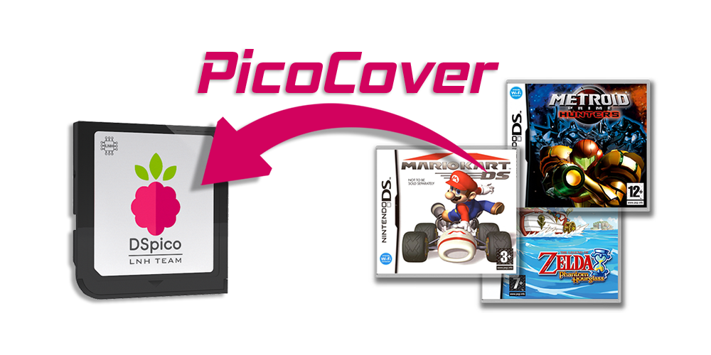
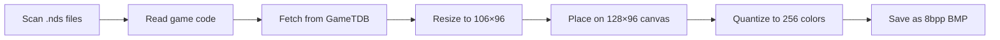

<div align="center">

# PicoCover



**Automatically download and convert Nintendo DS cover art for Pico Launcher**

**🌐 Primary experience: [PicoCover Web UI on GitHub Pages](https://scaletta.github.io/PicoCover/)**

[](LICENSE)
[](https://www.rust-lang.org/)
[](https://github.com/Scaletta/PicoCover/releases)


*Cross-platform tool to fetch GameTDB cover art, convert to 8bpp BMP format, and organize for [Pico Launcher](https://github.com/LNH-team/pico-launcher) by [LNH-team](https://github.com/LNH-team)*


</div>

---

## ✨ Features

- 🌐 **Web UI (Github Pages)** – **Recommended & easiest to use** – No installation required
  - Automatic ROM scanning
  - Real-time cover downloading and conversion
  - Works with File System Access API (Chrome, Edge, Opera)
  - Alternative method for non-supported modern browsers (Firefox, Brave)
  - Uses a proxy to fetch and cache GameTDB images for faster, more reliable downloads
- 🖥️ **GUI Mode** – Intuitive interface with automatic drive detection and tabbed view
  - Collapsible game lists (skipped/failed) for quick review
  - Overwrite toggle
- ⌨️ **CLI Mode** – Full scriptable control for automation
- 🔄 **Auto-update** – Built-in update checker with one-click updates
- ♻️ **Auto-refresh** – Detects new drives without restarting
- 🌍 **Multi-region support** – Tries EN, US, JA, EU until a cover is found
- 🚀 **Fast processing** – Parallel downloads with CPU-core adaptive threading
- 📦 **Native packages** – DMG for macOS, DEB for Linux, EXE for Windows

## 📋 Requirements

- **Web UI (GitHub Pages)**
  - Recommended (full folder access): Chrome 86+, Edge 86+, or Opera 72+
  - Supported (ZIP export fallback): Firefox, Brave
  - Your ROM folder accessible via File System Access API
  - Internet connection
- **Desktop/CLI/Build**
  - Rust 1.81+ for building from source
  - Network access to GameTDB art server
  - Write permissions to target drive

## 🚀 Get Started

### 🌐 Option 1: Use Online (No Installation!)

**Access PicoCover directly in your browser:**

👉 **[Launch PicoCover Web UI](https://scaletta.github.io/PicoCover/)**

**Requirements:**
- Chrome 86+, Edge 86+, or Opera 72+
- Your ROM folder accessible via File System Access API
- Internet connection

This is the **fastest and easiest way** to get started!

---

### Option 2: Download Pre-built Desktop Package
Download the latest release for your platform from the [Releases](https://github.com/Scaletta/PicoCover/releases) page:

- **Windows**: `pico_cover-windows-x64.exe` – Standalone executable
- **macOS**: `pico_cover-macos-x64.dmg` (Intel) or `pico_cover-macos-arm64.dmg` (Apple Silicon) – Disk image
- **Linux**: `pico_cover-linux-x64.deb` – Debian package

[](https://github.com/scaletta/PicoCover/releases/latest)

**Installation instructions:**
- **Windows**: Download and run the `.exe` file
- **macOS**: 
  1. Download `.dmg` and open it
  2. Drag PicoCover to Applications folder
  3. **First launch**: Right-click PicoCover.app → **Open** → Click **Open** in the dialog
  4. If you see "damaged" error: Go to **System Settings** → **Privacy & Security** → Scroll down and click **Open Anyway**
- **Linux**: `sudo dpkg -i pico_cover-linux-x64.deb` or run the standalone binary

### Option 3: Build from Source
```bash
git clone https://github.com/Scaletta/PicoCover.git
cd PicoCover
cargo build -p pico-cover --release
```

The binary will be in `target/release/pico_cover` (or `pico_cover.exe` on Windows).

**Build the WASM module (for the web UI):**
```bash
rustup target add wasm32-unknown-unknown
cargo build -p pico-cover-wasm --target wasm32-unknown-unknown --release
wasm-bindgen target/wasm32-unknown-unknown/release/pico_cover_wasm.wasm \
  --out-dir web/pkg \
  --target bundler
```

**Build all workspace crates:**
```bash
cargo build --workspace --release
```

**Build per platform (native GUI app):**
```bash
# Windows (x64)
rustup target add x86_64-pc-windows-msvc
cargo build -p pico-cover --release --target x86_64-pc-windows-msvc

# macOS (Intel)
rustup target add x86_64-apple-darwin
cargo build -p pico-cover --release --target x86_64-apple-darwin

# macOS (Apple Silicon)
rustup target add aarch64-apple-darwin
cargo build -p pico-cover --release --target aarch64-apple-darwin

# Linux (x64 GNU)
rustup target add x86_64-unknown-linux-gnu
cargo build -p pico-cover --release --target x86_64-unknown-linux-gnu
```

**Build native packages:**

*Windows is binary only*
```bash
# Install cargo-bundle
cargo install cargo-bundle

# macOS .app bundle
cargo bundle --release --target x86_64-apple-darwin     # Intel
cargo bundle --release --target aarch64-apple-darwin    # Apple Silicon

# Linux .deb package
cargo bundle --release --target x86_64-unknown-linux-gnu
```

## 🧱 Project Structure

- [crates/core](crates/core) – Pure Rust core (game code parsing + image processing)
- [crates/native-gui](crates/native-gui) – Desktop GUI app (eframe/egui)
- [crates/wasm](crates/wasm) – WASM bindings for the web UI
- [web](web) – React + Vite frontend for Github pages.
- [worker](worker) – Cloudflare Worker proxy + caching

## 🎯 Usage

### GUI Mode (Recommended)

Simply run the executable:
```bash
./pico_cover  # or double-click pico_cover.exe on Windows
```

**What the GUI does:**
1. 🔍 **Auto-detects** all drives with `_pico` folder
2. 🎉 **Update notifications** when new versions are available
3. 🔄 **Refresh button** to detect newly connected devices
4. 📊 **Real-time statistics** showing processed/saved/skipped/errors
5. � **Tabbed view** – Switch between:
   - **📄 Output Log** – Color-coded logs with detailed per-file status (green for saved, yellow for skipped, red for errors)
   - **📋 Game Lists** – Collapsible sections showing skipped and failed games for quick review
6. ⚡ **One-click processing** – just select drive and click Start
7. ✅ **Overwrite option** – Checkbox to control whether to overwrite existing covers

**Auto-Update:**
- The app automatically checks for updates on startup
- When a new version is available, a notification banner appears
- Click "Update Now" to download and install (app restarts automatically)

Covers are saved to: `<selected-drive>/_pico/covers/nds/<GAMECODE>.bmp`

### CLI Mode

For scripting, automation, or advanced control:

```bash
pico_cover --cli --root /path/to/roms \
  --regions EN,US,JA,EU \
  --overwrite \
  --timeout-secs 15
```

**CLI Options:**

| Option | Description | Default |
|--------|-------------|---------|
| `--root` | Base folder or drive containing NDS ROMs | `.` |
| `--regions` | Region codes to try (comma-separated) | `EN,US,JA,EU` |
| `--url-templates` | Custom URL patterns (semicolon-separated) | GameTDB default |
| `--overwrite` | Overwrite existing BMPs | `false` (skip) |
| `--timeout-secs` | HTTP request timeout in seconds | `15` |
| `--threads` | Number of parallel download threads | CPU core count |

**Example:**
```bash
# Process D: drive, overwrite existing covers
pico_cover --cli --root D:\ --overwrite

# Custom regions priority
pico_cover --cli --root /media/sdcard --regions JP,US,EN

# Use 4 threads for slower connections
pico_cover --cli --root /media/sdcard --threads 4
```

## 🔧 How It Works



1. **🔍 Scan** – Recursively finds all `.nds` files
2. **📄 Extract** – Reads 4-byte game code from NDS header
3. **🌐 Download** – Tries GameTDB URLs with each region until successful
4. **🖼️ Convert**:
   - Resize to 106×96 pixels (Lanczos3 filter)
   - Center on 128×96 black canvas (22px right padding for Pico Launcher UI)
   - Quantize to 256 colors using NeuQuant algorithm
   - Export as 8bpp paletted BMP
5. **💾 Save** – Store to `_pico/covers/nds/<GAMECODE>.bmp`

## 📝 Notes

- ✅ Output directory is auto-created if missing
- ✅ Errors are logged per-file; processing continues
- ⚠️ GUI mode always overwrites; CLI respects `--overwrite` flag
- ⚠️ Files without valid game codes are skipped
- ⚠️ Only works on Pico Launcher filesystem

## 🙌 Credits & Shoutout

**Huge thanks to [LNH-team](https://github.com/LNH-team) for creating [Pico Launcher](https://github.com/LNH-team/pico-launcher)!** 🎉

This tool is built for Pico Launcher by the LNH-Team. Without their amazing work on bringing a modern, fast & good-looking NDS Launcher this cover downloader wouldn't exist.

**Key projects from LNH-team:**
- [Pico Launcher](https://github.com/LNH-team/pico-launcher) – The launcher this tool supports
- [Pico Loader](https://github.com/LNH-team/pico-loader) – The firmware loader

**Special thanks to [GameTDB](https://www.gametdb.com/)** 🎨

A massive shoutout to [GameTDB](https://www.gametdb.com/) for providing and maintaining a comprehensive database of high-quality game cover artwork! Their free website makes this tool possible by giving us access to thousands of Nintendo DS covers.

## 🤝 Contributing

Contributions welcome! Feel free to:
- Report bugs via [Issues](https://github.com/Scaletta/PicoCover/issues)
- Submit feature requests
- Open pull requests

## 📜 License

This project is licensed under **Creative Commons Attribution-NonCommercial 4.0 International (CC BY-NC 4.0)**.

**You are free to:**
- ✅ Share and adapt the software
- ✅ Use for personal/non-commercial projects

**Under the following terms:**
- 📛 **Attribution** – Credit the original author
- 🚫 **NonCommercial** – No commercial use permitted

See [LICENSE](LICENSE) for full details.

---

<div align="center">

**Made with ❤️ for the Retro-Gaming community**

[Report Bug](https://github.com/Scaletta/PicoCover/issues) · [Request Feature](https://github.com/Scaletta/PicoCover/issues) · [Releases](https://github.com/Scaletta/PicoCover/releases)

</div>
