<div align="center">

# 🎮 PicoCover

**Automatically download and convert Nintendo DS cover art for Pico Launcher**

[](LICENSE)
[](https://www.rust-lang.org/)
[](https://github.com/Scaletta/PicoCover/releases)

*Cross-platform tool to fetch GameTDB cover art, convert to 8bpp BMP format, and organize for [Pico Launcher](https://github.com/LNH-team/pico-launcher) by [LNH-team](https://github.com/LNH-team)*

</div>

---

## ✨ Features

- 🖥️ **GUI Mode** – Simple interface with automatic drive detection
- ⌨️ **CLI Mode** – Full scriptable control for automation
- 🔄 **Auto-refresh** – Detects new drives without restarting
- 🌍 **Multi-region support** – Tries EN, US, JA, EU until a cover is found
- 🚀 **Fast processing** – Parallel downloads

## 📋 Requirements

- **Rust 1.81+** for building from source
- **Network access** to GameTDB art server
- **Write permissions** to target drive

## 🚀 Installation

### Option 1: Download Pre-built Binary
Download the latest release for your platform from the [Releases](https://github.com/Scaletta/PicoCover/releases) page.

### Option 2: Build from Source
```bash
git clone https://github.com/Scaletta/PicoCover.git
cd PicoCover
cargo build --release
```

**Cross-compile for other platforms:**
```bash
# Windows (x64)
cargo build --release --target x86_64-pc-windows-msvc

# macOS (Intel)
cargo build --release --target x86_64-apple-darwin

# macOS (Apple Silicon)
cargo build --release --target aarch64-apple-darwin

# Linux (x64)
cargo build --release --target x86_64-unknown-linux-gnu
```

## 🎯 Usage

### GUI Mode (Recommended)

Simply run the executable:
```bash
./pico-cover  # or double-click pico-cover.exe on Windows
```

**What the GUI does:**
1. 🔍 **Auto-detects** all drives with `_pico` folder
2. 🔄 **Refresh button** to detect newly connected devices
3. 📊 **Real-time statistics** showing processed/saved/skipped/errors
4. 📝 **Color-coded logs** for easy monitoring
5. ⚡ **One-click processing** – just select drive and click Start

Covers are saved to: `<selected-drive>/_pico/covers/nds/<GAMECODE>.bmp`

### CLI Mode

For scripting, automation, or advanced control:

```bash
pico-cover --cli --root /path/to/roms \
  --regions EN,US,JA,EU \
  --overwrite \
  --timeout-secs 15
```

**CLI Options:**

| Option | Description | Default |
|--------|-------------|---------|
| `--root` | Base folder or drive containing NDS ROMs | `.` |
| `--regions` | Region codes to try (comma-separated) | `EN,US,JA,EU` |
| `--url-templates` | Custom URL patterns (semicolon-separated) | GameTDB default |
| `--overwrite` | Overwrite existing BMPs | `false` (skip) |
| `--timeout-secs` | HTTP request timeout | `15` |

**Example:**
```bash
# Process D: drive, overwrite existing covers
pico-cover --cli --root D:\ --overwrite

# Custom regions priority
pico-cover --cli --root /media/sdcard --regions JP,US,EN
```

## 🔧 How It Works

```mermaid
graph LR
    A[Scan .nds files] --> B[Read game code]
    B --> C[Fetch from GameTDB]
    C --> D[Resize to 106×96]
    D --> E[Place on 128×96 canvas]
    E --> F[Quantize to 256 colors]
    F --> G[Save as 8bpp BMP]
```



1. **🔍 Scan** – Recursively finds all `.nds` files
2. **📄 Extract** – Reads 4-byte game code from NDS header
3. **🌐 Download** – Tries GameTDB URLs with each region until successful
4. **🖼️ Convert**:
   - Resize to 106×96 pixels (Lanczos3 filter)
   - Center on 128×96 black canvas (22px right padding for Pico Launcher UI)
   - Quantize to 256 colors using NeuQuant algorithm
   - Export as 8bpp paletted BMP
5. **💾 Save** – Store to `_pico/covers/nds/<GAMECODE>.bmp`

## 📝 Notes

- ✅ Output directory is auto-created if missing
- ✅ Errors are logged per-file; processing continues
- ⚠️ GUI mode always overwrites; CLI respects `--overwrite` flag
- ⚠️ Files without valid game codes are skipped
- ⚠️ Only works on Pico Launcher filesystem

## 🙌 Credits & Shoutout

**Huge thanks to [LNH-team](https://github.com/LNH-team) for creating [Pico Launcher](https://github.com/LNH-team/pico-launcher)!** 🎉

This tool is built for Pico Launcher by the LNH-Team. Without their amazing work on bringing a modern, fast & good-looking NDS Launcher this cover downloader wouldn't exist.

**Key projects from LNH-team:**
- [Pico Launcher](https://github.com/LNH-team/pico-launcher) – The launcher this tool supports
- [Pico Loader](https://github.com/LNH-team/pico-loader) – The firmware loader

**Special thanks to [GameTDB](https://www.gametdb.com/)** 🎨

A massive shoutout to [GameTDB](https://www.gametdb.com/) for providing and maintaining a comprehensive database of high-quality game cover artwork! Their free website makes this tool possible by giving us access to thousands of Nintendo DS covers.

## 🤝 Contributing

Contributions welcome! Feel free to:
- Report bugs via [Issues](https://github.com/Scaletta/PicoCover/issues)
- Submit feature requests
- Open pull requests

## 📜 License

This project is licensed under **Creative Commons Attribution-NonCommercial 4.0 International (CC BY-NC 4.0)**.

**You are free to:**
- ✅ Share and adapt the software
- ✅ Use for personal/non-commercial projects

**Under the following terms:**
- 📛 **Attribution** – Credit the original author
- 🚫 **NonCommercial** – No commercial use permitted

See [LICENSE](LICENSE) for full details.

---

<div align="center">

**Made with ❤️ for the Retro-Gaming community**

[Report Bug](https://github.com/Scaletta/PicoCover/issues) · [Request Feature](https://github.com/Scaletta/PicoCover/issues) · [Releases](https://github.com/Scaletta/PicoCover/releases)

</div>
